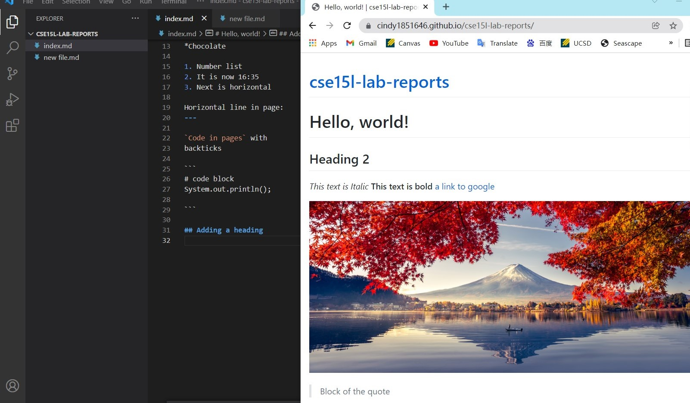

[Lab Report 1](lab-report-1-week-2.html)


# Hello, world!
## Heading 2
*This text is Italic*
**This text is bold**
[a link to google](https://www.google.com)


> Block of the quote

*List of things to eat
*Cookies
*Chocolate

1. Number list
2. It is now 16:35
3. Next is horizontal

Horizontal line in page:
---

`Code in pages` with 
backticks

```
# code block
System.out.println();

```

## Adding a heading


