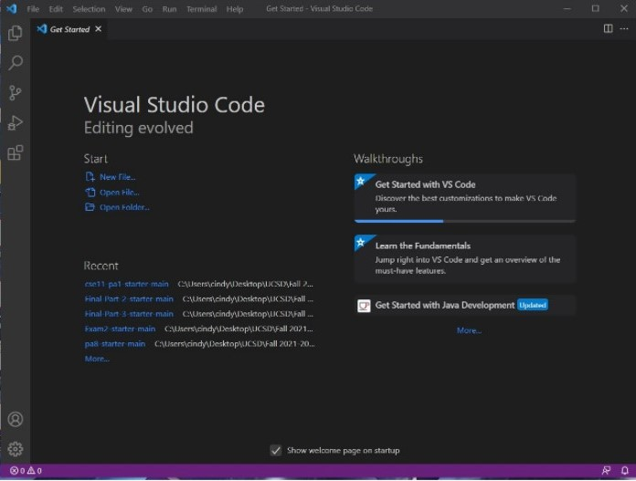
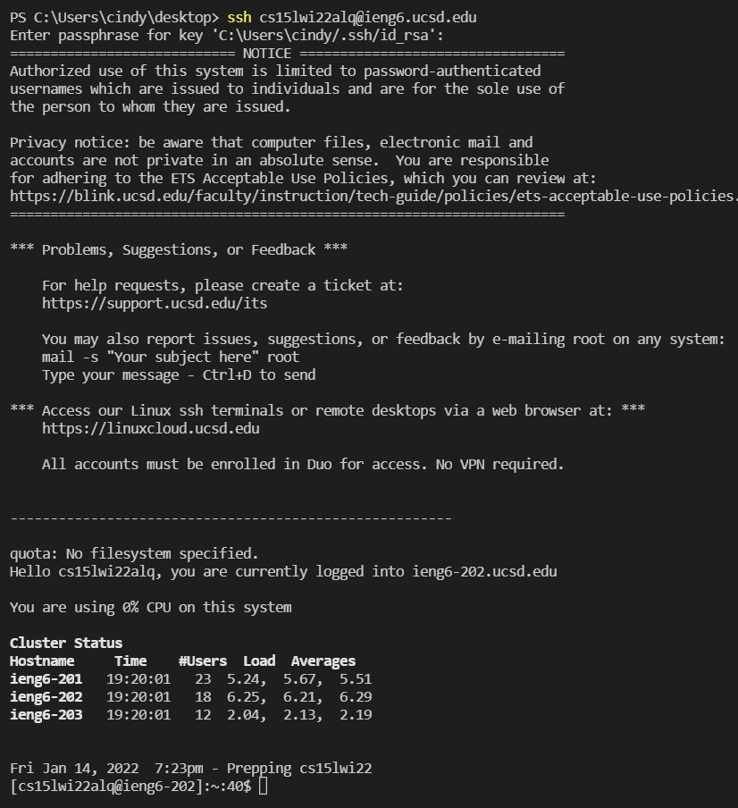
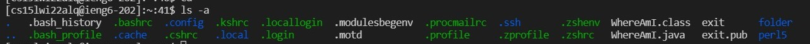
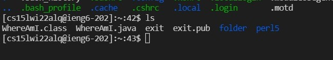
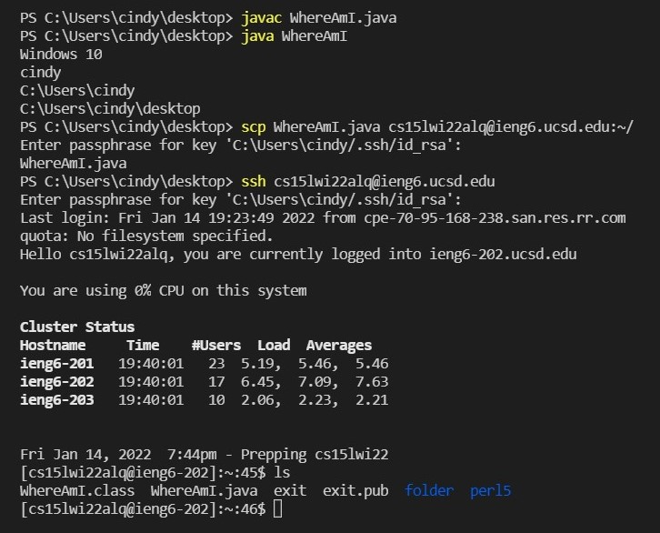
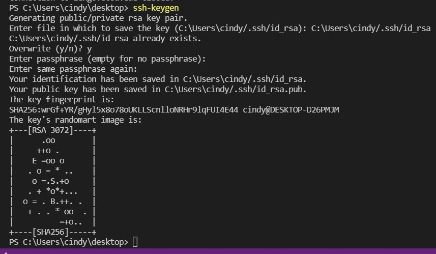
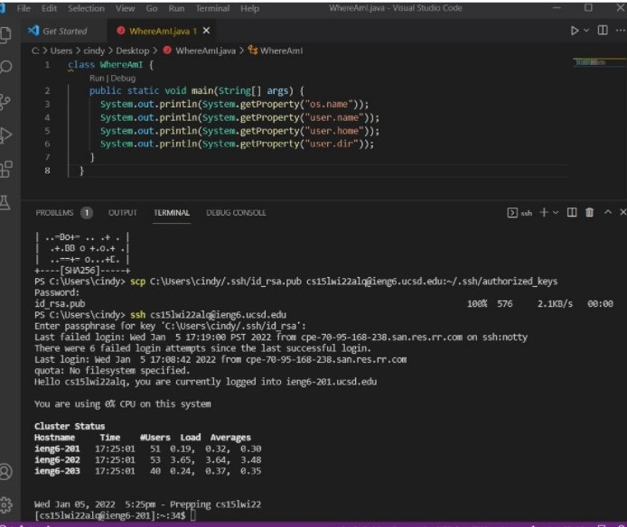
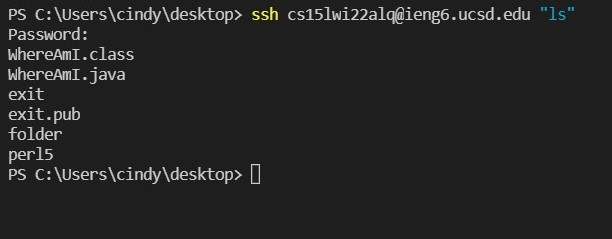

# Lab Report 1

* Installing VSCode <br/>
First you will need to download the VSCode from its website [https://code.visualstudio.com/](https://code.visualstudio.com/), follow the instructions on its website and install vscode in your own PC. After installing, open VSCode and you should see the following page.
<br/>
<br/>

<br/>
<br/>

* Remotely Connecting<br/>
Create a file and save it locally(client), then look up your user name for the ieng account it should be like this<br/>
    ```
    $ ssh cs15lwi22zz@ieng6.ucsd.edu 
    ```
    Instead of "zz" use your own course account. For me my account is "alq". Sign in to the account for remote access.After successfully signing in it should look like this.<br/><br/>
    
    <br/>
    <br/>
* Trying Some Commands<br/>
    1. ``` ls -a ``` This command lists all in the system it should be like this below. <br/>
        
    <br/><br/>
    2. ```cd ``` This command changes the current directory.<br/>
    3. ```ls ``` This command lists the files in the current directory. It should look like this bwlow.
    
    4. type ```exit``` can logout from the ieng account
<br/><br/>

* Moving Files with ```scp```<br/>
    First create a file called WhereAmI.java writing some print lines and then save it locally using the javac and java command check if it runs properly. Then save the file onto the ```ieng``` account using the command ```scp WhereAmI.java cs15lwi22alq@ieng6.ucsd.edu:~/``` sign in like before. Then sign in to the ieng account using the ls commend to check if the file is successfully saved into the ieng account.
<br/><br/>
    

* Setting an SSH Key<br/>
    There is an easier way to log in to the ieng account using a shorter keycode to login. First type in ```ssh-keygen``` on the client, then follow the commands below<br/>
    
    <br/><br/>
    Then save the key onto the server by logging in
    
<br/><br/>

* Optimizing Remote Running
    Using the command ```ssh cs15lwi22@ieng6.ucsd.edu "ls"``` can simply run the command "ls" on the server then exit automatically<br/>
    

