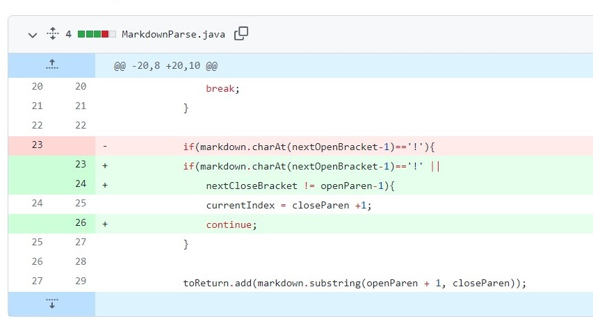

# Lab Report 2

* First code changes <br/>
    1. Below is the screen shot of the code change from GitHub<br/>
        
        </br>
    2. [the link to test file for failure-induction input](https://github.com/cindy1851646/markdown-parse/commit/2e651d9e1285ea050ab7488f16ebf3511a4720bb), the failure-inducting input is shown in below.<br/>

        <br/>

    3. When running the failure-inducing input of 
        ``` a link(https://something.com) ``` and
        ``` another link!(some-page.html)```
        the output failing is below. <br/>

        <br/>

    4. 
        First when the method is provided and run successfully with the default test case. Then we tried to change the test case to ``` a link(https://something.com) ``` and``` another link!(some-page.html)```. After running the changed test case, we see the outout different then what we expected. So we realized that there is bug in our code. Therefore, we go back and change the code with the test case and see the problem that problem of can not find when searching the "[" and "]" sign, therefore the index of "[" and "]"  cannot found. So we added an if statement to break the while loop when not search the open Bracket or closed Backet or openParen or closeParen. 
    <br/>


* Second Code Change
    1. Below is the screen shot of the code change from GitHub<br/>

        

    2. [the link to test file for failure-induction input](https://github.com/cindy1851646/markdown-parse/commit/071093aca8ae5e368fcd34a6ae31db04b21ffbea), the failure-inducting input is shown in below.

        <br/>
    
    3. When running the failure-inducing input of 
        ```[a link!](https://something.com) ``` and
        ``` [another link!]hello(some-page.html)```
        the output failing is below. <br/>

        <br/>
    
    4. The changed test case ```[a link!](https://something.com) ``` and ``` [another link!]hello(some-page.html)``` is failing to get the expected output. SO we needed to change the code, added the part to check if the close bracket is one index behind the openParen. After changing the code the failure-inducing input is successfully fixed and output is expected.

* Third code changes <br/>
    1. Below is the screen shot of the code change from GitHub<br/> 
        
        </br>
    
    2. [the link to test file for failure-induction input](https://github.com/cindy1851646/markdown-parse/commit/a5260621347ab730751b51a7f54e5fde7820c61d), the failure-inducting input is shown in below.

        <br/>
    
    3. When running the failure-inducing input of 
        ```[](a link on the first line)[ ``` andthe output failing is below. <br/>

        <br/>
    
    4. The failure-inducing input is ```[](a link on the first line)[ ``` when runing this with the original code, it produces a bug with indexmout of bounds, therefore, we changed the code at line 24 added the line ``` nextOpenBracket>0 &&``` to prevent index out of bounds. After changing the code, the testfile runs and the input produces expected output. 

