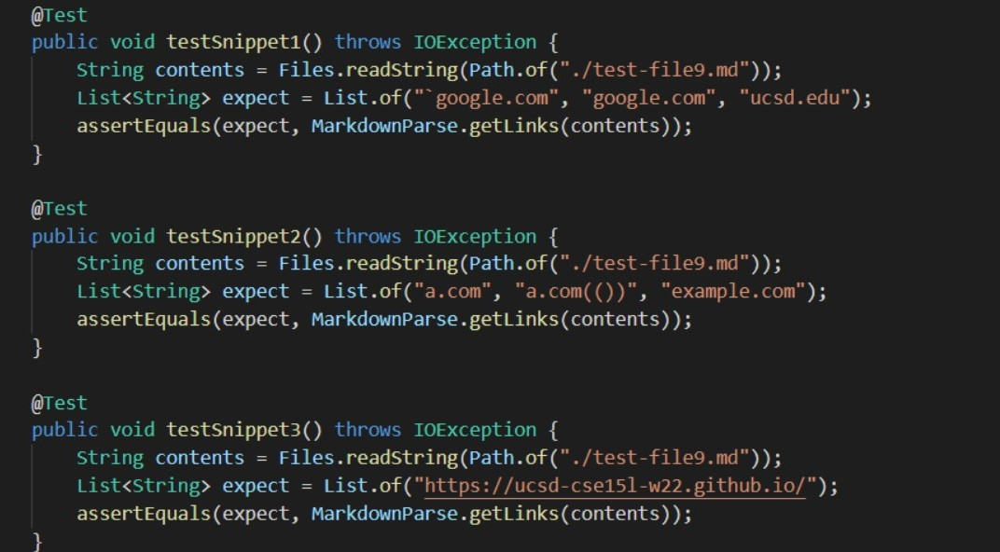
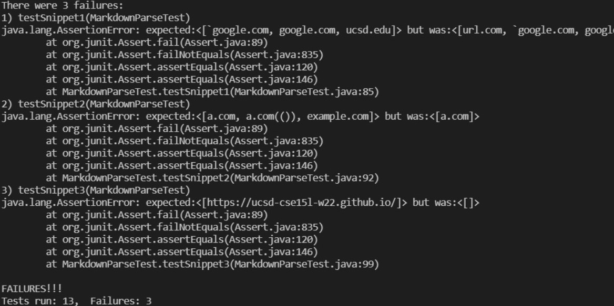
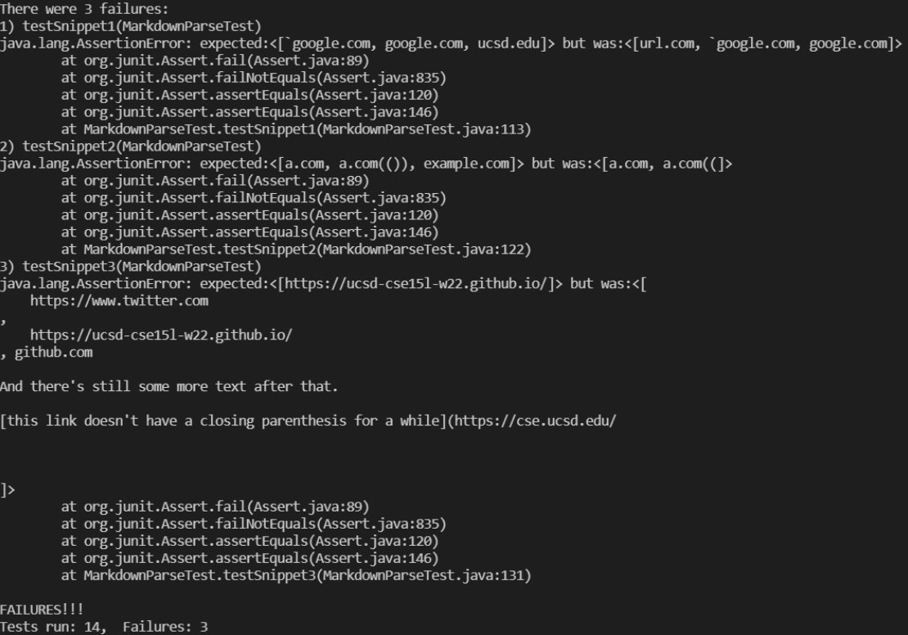

# Lab Report 4
1. Link to our groups [makrdown-parse](https://github.com/cindy1851646/markdown-parse)
2. Link to the [other group's markdown-parse that we reviewed](https://github.com/annakkin/markdown-parse)

## Three tests that will be used 
1. Snippet 1
    ```
    `[a link`](url.com)

    [another link](`google.com)`

    [`cod[e`](google.com)

    [`code]`](ucsd.edu)
    ```
2. Snippet 2
    ```
    [a [nested link](a.com)](b.com)

    [a nested parenthesized url](a.com(()))

    [some escaped \[ brackets \]](example.com)
    ```
3. Snippet 3
    ```
    [this title text is really long and takes up more than 
    one line

    and has some line breaks](
    https://www.twitter.com
    )

    [this title text is really long and takes up more than 
    one line](
    https://ucsd-cse15l-w22.github.io/
    )


    [this link doesn't have a closing parenthesis](github.com

    And there's still some more text after that.

    [this link doesn't have a closing parenthesis for a while](https://cse.ucsd.edu/


    )

    And then there's more text
    ```
    </br>

    Using VS code shortcut, I can determine the expected output for the three test cases. The screenshot of the expect result and 3 test is shown below. </br>

    
    </br>

## Running the tests</br>

* When running the three test, both of our group's markdon-parse and the other group's failed the test, the result of test is shown in below screenshot.</br></br>

    Our group's repository:
    
    </br></br>

    Other group's repository we reviewed:
    
    </br>

## Is there small code change that can fix the problem?
</br>

* Do you think there is a small (<10 lines) code change that will make your program work for snippet 1 and all related cases that use inline code with backticks? If yes, describe the code change. If not, describe why it would be a more involved change.
    </br></br>
    For Snippet 1, I don't think there is a small (<10 lines) coed change that can make the program work. In both of the code we did not have the trigger for backticks so in order to let the code to ignore what is in the backticks, it might take about 15 lines of code to change the code and then can run the test successfully.

* Do you think there is a small (<10 lines) code change that will make your program work for snippet 2 and all related cases that use inline code with backticks? If yes, describe the code change. If not, describe why it would be a more involved change.
    </br></br>
    For snippet w, I don't believe there is a small(<10 lines) code change that can make the program work. It would take about 15-20 lines of code change to pair the ```nextOpenBracket``` and the ```nextCloseBracket```, because the markdownParse would be confused by the nested brackets if we don't do this.</br>

* Do you think there is a small (<10 lines) code change that will make your program work for snippet 3 and all related cases that use inline code with backticks? If yes, describe the code change. If not, describe why it would be a more involved change.
    </br></br>
    Yes, I think if we can fix the problem by simply checking if there are too many lines of character in between square Brackets and the fix should be less than 10 lines of code change.   


