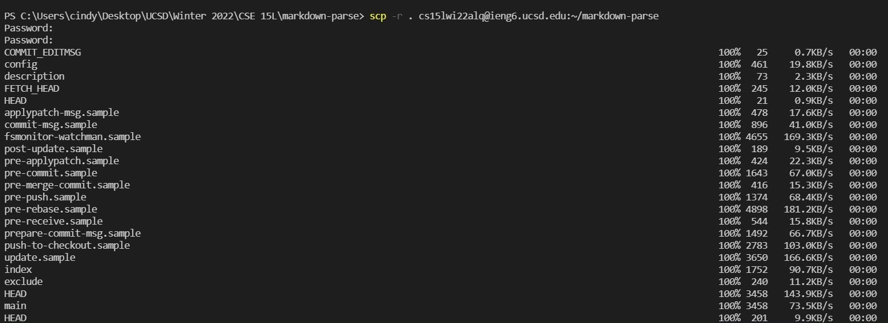
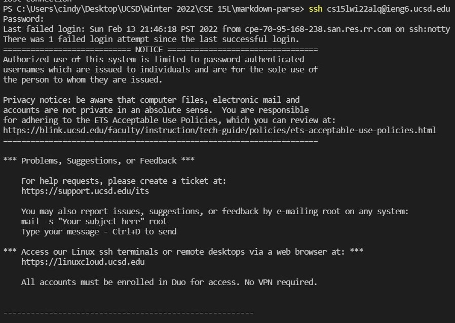
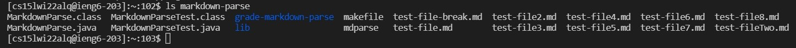
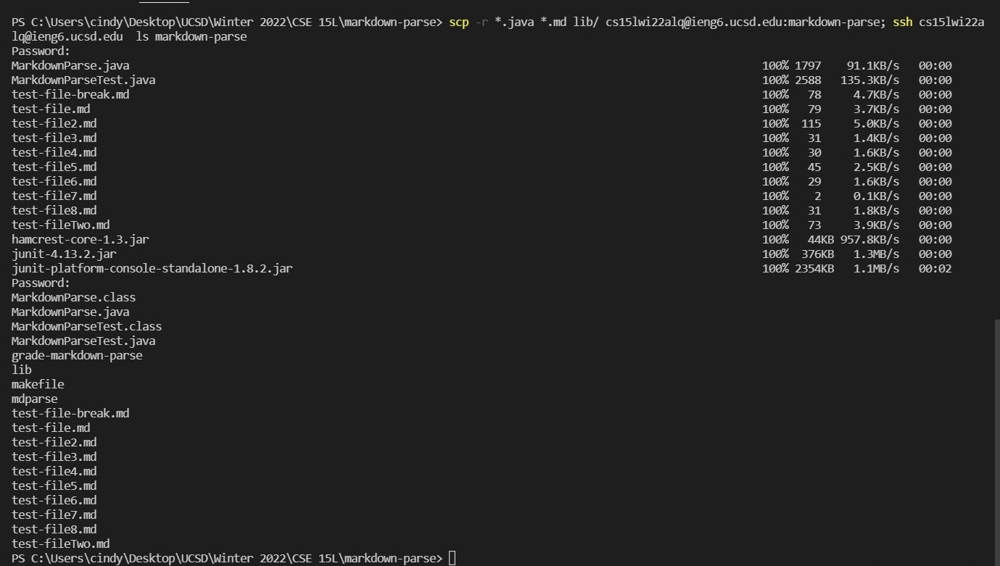

# Lab Report 3: Copy whole directories with ```scp -r```

* The image of copying the whole markdown-parse directory to the ieng6 account is below.
    <br/>
    
    Using the command  ```scp -r . cs15lwi22alq@ieng6.ucsd.edu:~/markdown-parse ``` to copy the whole markdown-parse directory to the ieng6 account.
 
<br/>

* Show logging into your ieng6 account after doing this and compiling and running the tests for your repository 
    <br/>
    
    Using ``` ssh cs15lwi22alq@ieng6.ucsd.edu ``` to log in to your ieng6 account. <br/>

    
    <br/>

    Then use the ``` ls markdown-parse ``` command to list all the files in directory markdown-parse.<br/>

    
<br/>

* Show combining scp, ;, and ssh to copy the whole directory and run some command in one line.
    <br/>
    
<br/>
